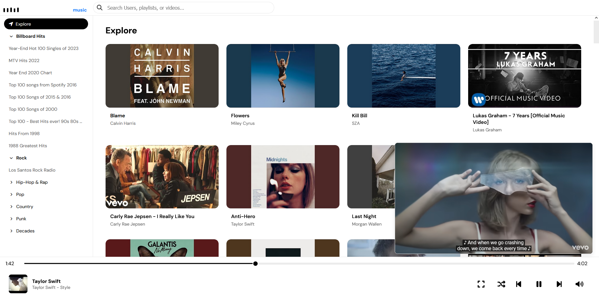
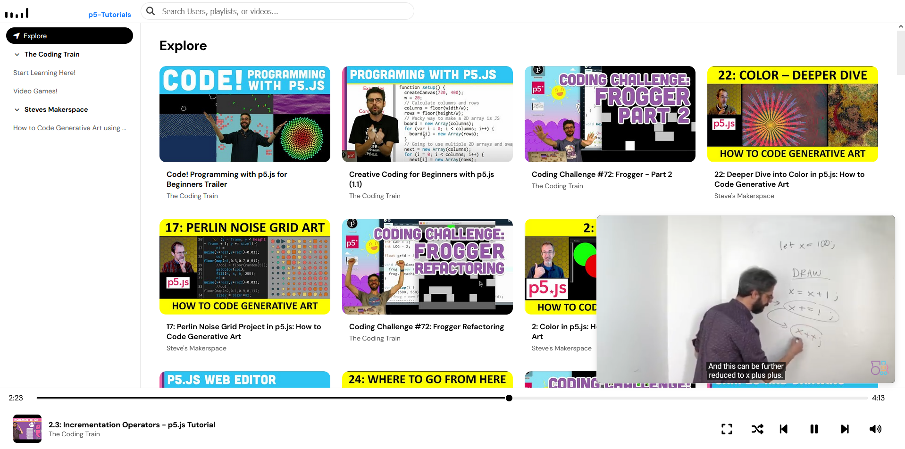

# 🎵 Playlist.json — Community-Powered YouTube Playlists

Playlist.json is a lightweight, front-end-only web application that serves YouTube media content without relying on the YouTube API. It aims to create a community-managed repository of YouTube playlists, accessible through a simple JSON structure that anyone can contribute to or customize. This approach allows you to create, share, and manage media playlists easily—no API keys, no server-side processing, and no backend setup required.




*EXAMPLES*
- [Music Application](https://tezumie.github.io/Playlist.json/?gitlist=Tezumie/Playlist.json/refs/heads/main/playlists/music);
  
- [P5 Tutorials](https://tezumie.github.io/Playlist.json/?playlist=p5-Tutorials);

## ✨ Features

- **Frontend-Only Implementation**: Runs entirely on HTML, CSS, and JavaScript. No API keys or server-side code needed.
- **Playlist JSON Structure**: All YouTube video data is stored in a single `playlist.json` file, making it easy to edit or contribute.
- **Community-Managed Content**: Contributors can add or update playlists by editing the `playlist.json` file on GitHub, fostering collaboration.
- **Dynamic Playlists**: Easily create and serve any YouTube playlist using just the JSON format. Utilize the built-in extractor tool to generate JSON files from YouTube playlists quickly.
- **Customizable & Extendable**: Use as a template for building your own media-serving sites—ideal for tutorials, educational series, or unique collections.

## 🎯 Purpose

Playlist.json provides a simple yet powerful way to serve YouTube content without the constraints of API restrictions or complex backend setups. Organize and display any set of YouTube videos—from music albums to educational series—on your custom site without needing API keys or backend services.

## 📂 How It Works

- **`playlist.json` File**: Stores all media data (video titles, IDs, thumbnails, etc.) as the core content source.
- **No Backend Required**: Handles everything client-side, making it easy to deploy anywhere (e.g., GitHub Pages, Firebase Hosting).
- **Built-in Playlist Extractor Tool**: Create JSON files from any public YouTube playlist using the included extractor tool, which generates and formats your playlist data.
- **Frontend Rendering**: Uses plain JavaScript and HTML to render playlists, allowing simple integration and customization.

## 🔧 How to Use

### Using the Data in Your Own Application

You can integrate the playlist data into your own application by fetching the JSON file from the GitHub repository's raw file location.

```js
fetch('https://raw.githubusercontent.com/username/repo/branch/playlists/music.json')
  .then(response => response.json())
  .then(data => {
    console.log('Playlist Data:', data);
    // Use the data to render playlists in your application
  })
  .catch(error => console.error('Error fetching playlist data:', error));
```
### Creating JSON from a YouTube Playlist

Use the [Playlist JSON Extractor](https://tezumie.github.io/Playlist.json/tools/json-extractor.html) to generate your JSON data.

1. Open the YouTube playlist page.
2. Right-click and select "View Page Source" (`Ctrl+U` or `Cmd+U`).
3. Copy all the HTML code and paste it into the extractor tool.
4. Click "Extract Playlist Data" and then "Copy Extracted Data."
5. Add your playlist to the example format found in `playlists/playlist.json`.

### Using the Playlist.json Application with Your Data

Alternatively, you can use the Playlist.json application to display your playlists by specifying your JSON file via URL parameters.

1. **Host Your JSON File**: Ensure your `playlist.json` is hosted and accessible, such as on GitHub Pages or any static file hosting service.
2. **Use URL Parameters**: Append your JSON file URL to the Playlist.json app using the `playlist` or `gitlist` parameters.

#### URL Parameter Options:

- **`playlist`**: Loads a local file from the `playlists/` folder (e.g., `?playlist=p5-Tutorials` → `playlists/p5-Tutorials.json`).
- **`gitlist`**: Loads a file from a GitHub repository (e.g., `?gitlist=username/repo/branch/path` → `https://raw.githubusercontent.com/username/repo/branch/path.json`).

#### Examples:

```js
https://tezumie.github.io/Playlist.json?playlist=p5-Tutorials
```
Loads `https://tezumie.github.io/Playlist.json/?playlist=p5-Tutorials.json`.

```js
https://tezumie.github.io/Playlist.json?gitlist=username/repo/branch/playlist/music.json
```
Loads `https://tezumie.github.io/Playlist.json?gitlist=Tezumie/Playlist.json/refs/heads/main/playlists/music.json`.




## 📈 Expanding the Playlists

The heart of Playlist.json lies in its `playlists/` folder. By adding and expanding playlists, you drive the growth and diversity of the project. Here's how you can contribute:

- **Add New Playlists**: Create new playlist entries in the `playlists/playlist.json` file by following the existing structure. Include relevant details like playlist name, description, and songs.
- **Organize Categories**: Group similar playlists under appropriate categories to make navigation easier for users.
- **Enhance Existing Playlists**: Update and enrich current playlists by adding more songs or improving descriptions.
- **Ensure Data Quality**: Make sure that each song entry includes accurate video IDs, titles, artists, and thumbnail URLs.

Your contributions help build a rich and comprehensive repository of YouTube playlists that benefits the entire community!

## 🎨 Example Use Cases

- **Music Library**: Organize and display music videos in a structured format, allowing users to browse through genres, artists, and albums.
- **Educational Content**: Create playlists for tutorial series or course content, such as lectures, coding tutorials, or step-by-step guides.
- **Video Libraries**: Build a personal library of YouTube videos, like movie trailers, documentaries, or curated content collections.
- **Media Showcases**: Create unique showcases, such as "Top 10 of 2023" or "My Favorite Videos," and embed them on a website.

## 🤝 Contributing

We welcome contributions from the community! To contribute to Playlist.json, please follow these guidelines:

1. **Fork the Repository**: Click the "Fork" button at the top right of this page to create your own fork of the repository.
2. **Clone Your Fork**: Clone the forked repository to your local machine.
3. **Create a Branch**: Create a new branch for your feature or bugfix.
4. **Make Your Changes**: Implement your changes, following the existing code style and guidelines.
5. **Commit Your Changes**: Commit your changes with clear and descriptive commit messages.
6. **Push to Your Fork**: Push your changes to your forked repository.
7. **Create a Pull Request**: Open a pull request to the main repository, describing your changes and their purpose.

### 🌟 Contribution Types

- ✨ **Ideas**: Ideas, suggestions, and feature requests
- 💻 **Code**: Code contributions
- 📝 **Documentation**: Documentation
- 🎨 **Design**: Design
- 🔧 **Maintenance**: Maintenance
- 🐛 **Bug Reports**: Bug reports

## 🙌 Contributors

Thanks to all the people who contribute to this project!

```markdown
| Name      | GitHub                                | Contributions |
|-----------|---------------------------------------|---------------|
| Tezumie   | [@tezumie](https://github.com/tezumie) | 💻, 📝         |
| ...       | ...                                   | ...           |
| Your Name | [@yourusername](https://github.com/yourusername) | ✨, 💻         |
```

### How to Add Yourself

If you'd like to contribute and be listed here, follow these steps:

1. **Add Your GitHub Username** and specify your contribution types in the table above.
2. **Submit a Pull Request** to update the contributors list.

Copy the first row as a template to add more contributors.
